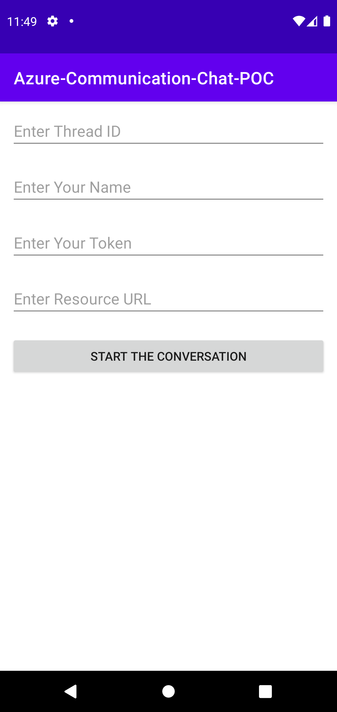

# Azure Communication Services-Android Chat App

This is the simple Chat app implemented with the help of Azure Communication Services-Chat library.

For more details, refer to the blog on:

1. [Android Chat App In Six Simple Steps Using Azure Communication](https://blog.kiprosh.com/android-chat-app-using-azure-communication/)
2. [How to build a robust chat app using Azure Communications Service?](https://blog.kiprosh.com/how-to-build-a-robust-chat-app-using-azure-communications-service/)

## Screenshots:
### First Screen:

### Chat Screen:

